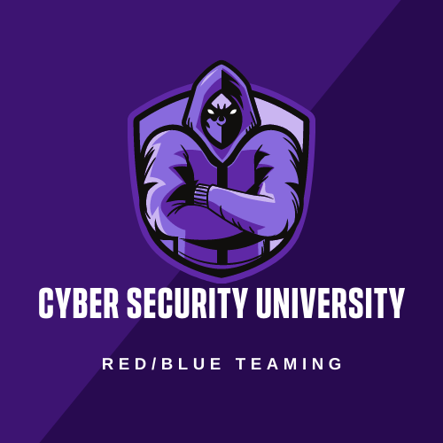

# Awesome Cyber Security University 

> A curated list of awesome and free educational resources that focuses on learn by doing.

 
<i>Because education should be free.</i>
 

## Contents

* [About](#about)
* [Introduction and Pre-Security](#introduction-and-pre-security) - (Completed/In Progress)
* [Free Beginner Red Team Path](#free-beginner-red-team-path) - (Add your badge here. The badge code is hidden in this repo)
* [Free Beginner Blue Team Path](#free-beginner-blue-team-path) - (Add your badge here. The badge code is hidden in this repo)
* [Bonus CTF practice and Latest CVEs](#bonus-ctf-practice-and-latest-cves) - (Completed/In Progress)
* [Bonus Windows](#bonus-windows) - (Completed/In Progress)
* [Extremely Hard Rooms to do](#extremely-hard-rooms-to-do) - (Completed/In Progress)

<!-- | Paths                              | Completion |
| -------------------------------- | ---------------------|
|[Introduction and Pre-Security](#-introduction-and-pre-security) |(Completed/In Progress) |
|[Free Beginner Red Team Path](#-free-beginner-red-team-path)   |(Add your badge here. Badge code is hidden in this repo) |
|[Free Beginner Blue Team Path](#-free-beginner-blue-team-path)  |(Add your badge here. Badge code is hidden in this repo) |
|[Bonus CTF practice & Latest CVEs](#-bonus-ctf-practice-and-latest-cves)|(Completed/In Progress)|
|[Bonus Windows](#-bonus-windows)|(Completed/In Progress)|
|[Extremely Hard Rooms to do](#-extremely-hard-rooms-to-do)    |(Completed/In Progress) | -->

## About

Cyber Security University is A curated list of awesome and free educational resources that focus on learning by doing.

There are 6 parts to this. 
1. Introduction and Pre-security
2. Free Beginner Red Team Path
3. Free Beginner Blue Team Path
4. Bonus practices
5. Latest CVEs
6. Extremely Hard rooms
The tasks are linear in nature of the difficulty. So it's recommended to do it in order. But you can still jump around and skip some rooms If you find that you are already familiar with the concepts.

<!--lint disable double-link-->
As you go through the curriculum, you will find completion badges that are hidden within this [`README.md`](https://github.com/brootware/Cyber-Security-University/blob/main/README.md) for both red and blue team path completion badges. You can copy the HTML code for them and add it to the content page below once you have completed them.

<!--lint disable double-link-->
[↑](#contents)
<!--lint enable double-link-->
## Contributing

Pull requests are welcome with the condition that the resource should be free! Please read the [contribution guide in the wiki](https://github.com/brootware/Cyber-Security-University/wiki) if you wish to add tools or resources.

## Introduction and Pre-Security

### Level 1 - Intro

<!--lint disable double-link-->
* [OpenVPN](<https://tryhackme.com/room/openvpn>) - Learn how to connect to a virtual private network using OpenVPN.<!--lint enable double-link-->
* [Welcome](<https://tryhackme.com/jr/welcome>) - Learn how to use a TryHackMe room to start your upskilling in cyber security.
* [Intro to Researching](<https://tryhackme.com/room/introtoresearch>) - A brief introduction to research skills for pentesting.
* [Linux Fundamentals 1](<https://tryhackme.com/room/linuxfundamentalspart1>) - Embark on the journey of learning the fundamentals of Linux. Learn to run some of the first essential commands on an interactive terminal.
* [Linux Fundamentals 2](<https://tryhackme.com/room/linuxfundamentalspart2>) - Embark on the journey of learning the fundamentals of Linux. Learn to run some of the first essential commands on an interactive terminal.
* [Linux Fundamentals 3](<https://tryhackme.com/room/linuxfundamentalspart3>) - Embark on the journey of learning the fundamentals of Linux. Learn to run some of the first essential commands on an interactive terminal.
* [Pentesting fundamentals](<https://tryhackme.com/room/pentestingfundamentals>) - Fundamentals of penetration testing.
* [Principles of security](<https://tryhackme.com/room/principlesofsecurity>) - Principles of security.
* [Red Team Engagements](<https://tryhackme.com/room/redteamengagements>) - Intro to red team engagements.
* [Hip Flask](https://tryhackme.com/room/hipflask) - An in-depth walkthrough covering pentest methodology against a vulnerable server.
* [Practice Linux Commands](https://labex.io/courses/linux-basic-commands-practice-online) - A free course with 41 hands-on labs to practice and master the most commonly used Linux commands.

<!-- markdownlint-disable MD036 -->
**Introductory CTFs to get your feet wet**<!-- markdownlint-enable MD036 -->

* [Google Dorking](<https://tryhackme.com/room/googledorking>) - Explaining how Search Engines work and leveraging them into finding hidden content!
* [Osint](<https://tryhackme.com/room/ohsint>) - Intro to Open Source Intelligence.
* [Shodan.io](<https://tryhackme.com/room/shodan>) - Learn about Shodan.io and how to use it for device enumeration.

<!--lint disable double-link-->
[↑](#contents)<!--lint enable double-link-->

## Free Beginner Red Team Path

### Level 2 - Tooling

* [Tmux](<https://tryhackme.com/room/rptmux>) - Learn to use tmux, one of the most powerful multi-tasking tools on linux.
* [Nmap,Curl and Netcat](<https://echoctf.red/challenge/1>) - Get experience with Nmap, Curl and Netcat for network communications.
* [Web Scanning](<https://tryhackme.com/room/rustscan>) - Learn the basics of automated web scanning.
* [Subdomain Enumeration](<https://tryhackme.com/room/subdomainenumeration>) - Learn how to find subdomains with different techniques.
* [Metasploit](<https://tryhackme.com/room/metasploitintro>) - An introduction to the main components of the Metasploit Framework.
* [Hydra](<https://tryhackme.com/room/hydra>) - Learn about and use Hydra, a fast network logon cracker, to bruteforce and obtain a website's credentials.
* [Linux Privesc](<https://tryhackme.com/room/linuxprivesc>) - Practice your Linux Privilege Escalation skills on an intentionally misconfigured Debian VM with multiple ways to get root! SSH is available.
* [Red Team Fundamentals](<https://tryhackme.com/room/redteamfundamentals>) - Learn about the basics of a red engagement, the main components and stakeholders involved, and how red teaming differs from other cyber security engagements.
* [Red Team Recon](<https://tryhackme.com/room/redteamrecon>) - Learn how to use DNS, advanced searching, Recon-ng, and Maltego to collect information about your target.
* [Nmap Tutorials](https://labex.io/tutorials/quick-start-with-nmap-free-tutorials-400132) - Learn and practice the basics of network scanning using Nmap.

<!-- markdownlint-disable MD036 -->
**Red Team Intro CTFs**<!-- markdownlint-enable MD036 -->

* [Vulnversity](<https://tryhackme.com/room/vulnversity>) - Learn about active recon, web app attacks and privilege escalation.
* [Blue](<https://tryhackme.com/room/blue>) - Deploy & hack into a Windows machine, leveraging common misconfigurations issues.
* [Simple CTF](<https://tryhackme.com/room/easyctf>) - Beginner level CTF.
* [Bounty Hacker](<https://tryhackme.com/room/cowboyhacker>) - A space cowboy-themed boot to root machine.

<!--lint disable double-link-->
[↑](#contents)<!--lint enable double-link-->

### Level 3 - Crypto & Hashes with CTF practice

* [Crack the hash](<https://tryhackme.com/room/crackthehash>) - Cracking hash challenges.
* [Agent Sudo](<https://tryhackme.com/room/agentsudoctf>) - You found a secret server located under the deep sea. Your task is to hack inside the server and reveal the truth.
* [The Cod Caper](<https://tryhackme.com/room/thecodcaper>) - A guided room taking you through infiltrating and exploiting a Linux system.
* [Ice](<https://tryhackme.com/room/ice>) - Deploy & hack into a Windows machine, exploiting a very poorly secured media server.
* [Lazy Admin](<https://tryhackme.com/room/lazyadmin>) - Easy linux machine to practice your skills.
* [Basic Pentesting](<https://tryhackme.com/room/basicpentestingjt>) - This is a machine that allows you to practice web app hacking and privilege escalation.
* [Bypassing UAC](https://tryhackme.com/room/bypassinguac) - Learn common ways to bypass User Account Control (UAC) in Windows hosts.

<!--lint disable double-link-->
[↑](#contents)<!--lint enable double-link-->

### Level 4 - Web

* [OWASP top 10](<https://tryhackme.com/room/owasptop10>) - Learn about and exploit each of the OWASP Top 10 vulnerabilities; the 10 most critical web security risks.
* [Inclusion](<https://tryhackme.com/room/inclusion>) - A beginner-level LFI challenge.
* [Injection](<https://tryhackme.com/room/injection>) - Walkthrough of OS Command Injection. Demonstrate OS Command Injection and explain how to prevent it on your servers.
* [Juiceshop](<https://tryhackme.com/room/owaspjuiceshop>) - This room uses the OWASP juice shop vulnerable web application to learn how to identify and exploit common web application vulnerabilities.
* [Overpass](<https://tryhackme.com/room/overpass>) - What happens when some broke CompSci students make a password manager.
* [Year of the Rabbit](<https://tryhackme.com/room/yearoftherabbit>) - Can you hack into the Year of the Rabbit box without falling down a hole.
* [DevelPy](<https://tryhackme.com/room/bsidesgtdevelpy>) - Boot2root machine for FIT and bsides Guatemala CTF.
* [Jack of all trades](<https://tryhackme.com/room/jackofalltrades>) - Boot-to-root originally designed for Securi-Tay 2020.
* [Bolt](https://tryhackme.com/room/bolt) - Bolt themed machine to root into.

<!--lint disable double-link-->
[↑](#contents)<!--lint enable double-link-->

### Level 5 - Reverse Engineering & Pwn

* [Windows x64 Assembly](<https://tryhackme.com/r/room/win64assembly>) - Introduction to x64 Assembly on Windows.
* [CC Ghidra](<https://tryhackme.com/room/ccghidra>) - This room teaches the basics of ghidra.
* [CC Radare2](<https://tryhackme.com/room/ccradare2>) - This room teaches the basics of radare2.
* [Reverse Engineering](<https://tryhackme.com/room/reverseengineering>) - This room focuses on teaching the basics of assembly through reverse engineering.
* [Reversing ELF](<https://tryhackme.com/room/reverselfiles>) - Room for beginner Reverse Engineering CTF players.
* [Dumping Router Firmware](<https://tryhackme.com/room/rfirmware>) - Reverse engineering router firmware.
* [Intro to pwntools](<https://tryhackme.com/room/introtopwntools>) - Introduction to popular pwn tools framework.
* [Pwnkit: CVE-2021-4034](<https://tryhackme.com/room/pwnkit>) - Interactive lab for exploiting and remediating Pwnkit (CVE-2021-4034) in the Polkit package.

<!--lint disable double-link-->
[↑](#contents)<!--lint enable double-link-->

### Level 6 - PrivEsc

* [Sudo Security Bypass](<https://tryhackme.com/room/sudovulnsbypass>) - A tutorial room exploring CVE-2019-14287 in the Unix Sudo Program. Room One in the SudoVulns Series.
* [Sudo Buffer Overflow](<https://tryhackme.com/room/sudovulnsbof>) - A tutorial room exploring CVE-2019-18634 in the Unix Sudo Program. Room Two in the SudoVulns Series.
* [Windows Privesc Arena](<https://tryhackme.com/room/windowsprivescarena>) - Students will learn how to escalate privileges using a very vulnerable Windows 7 VM.
* [Linux Privesc Arena](<https://tryhackme.com/room/linuxprivescarena>) - Students will learn how to escalate privileges using a very vulnerable Linux VM.
* [Windows Privesc](<https://tryhackme.com/room/windows10privesc>) - Students will learn how to escalate privileges using a very vulnerable Windows 7 VM.
* [Blaster](<https://tryhackme.com/room/blaster>) - Metasploit Framework to get a foothold.
* [Ignite](<https://tryhackme.com/room/ignite>) - A new start-up has a few security issues with its web server.
* [Kenobi](<https://tryhackme.com/room/kenobi>) - Walkthrough on exploiting a Linux machine. Enumerate Samba for shares, manipulate a vulnerable version of proftpd and escalate your privileges with path variable manipulation.
* [Capture the flag](<https://tryhackme.com/room/c4ptur3th3fl4g>) - Another beginner-level CTF challenge.
* [Pickle Rick](<https://tryhackme.com/room/picklerick>) -  Rick and Morty themed LFI challenge.

> Congratulations! If you have finished until here. You deserve a badge! Put this in your writeups or git profile. You can continue doing the below CTFs.

  
Click here to get your red team badge!

<https://gist.github.com/brootware/e30a10dbccf334eb95da7ea59d6f87fe>

<!--lint disable double-link-->
[↑](#contents)<!--lint enable double-link-->

## Free Beginner Blue Team Path

### Level 1 - Tools

* [Introduction to digital forensics](https://tryhackme.com/room/introdigitalforensics) - Intro to Digital Forensics.
* [Windows Fundamentals](<https://tryhackme.com/room/windowsfundamentals1xbx>) -  Intro to Windows.
* [Nessus](<https://tryhackme.com/room/rpnessusredux>) - Intro to nessus scan.
* [Mitre](<https://tryhackme.com/room/mitre>) -  Intro to Mitre attack framework.
* [IntroSIEM](https://tryhackme.com/room/introtosiem) - Introduction to SIEM.
* [Yara](<https://tryhackme.com/room/yara>) -  Intro to yara for malware analysis.
* [OpenVAS](<https://tryhackme.com/room/openvas>) - Intro to openvas.
* [Intro to Honeypots](<https://tryhackme.com/room/introductiontohoneypots>) -  Intro to honeypots.
* [Volatility](<https://cyberdefenders.org/blueteam-ctf-challenges/redline/>) - Intro to memory analysis with volatility.
* [Red Line](<https://tryhackme.com/room/btredlinejoxr3d>) - Learn how to use Redline to perform memory analysis and scan for IOCs on an endpoint.
* [Autopsy](<https://tryhackme.com/room/autopsy2ze0>) - Use Autopsy to investigate artifacts from a disk image.

<!--lint disable double-link-->
[↑](#contents)<!--lint enable double-link-->

### Level 2 - Security Operations, Incident Response & Threat Hunting

* [Investigating Windows](<https://tryhackme.com/room/investigatingwindows>) - Investigating Windows.
* [Juicy Details](<https://tryhackme.com/room/juicydetails>) - A popular juice shop has been breached! Analyze the logs to see what had happened.
* [Carnage](<https://tryhackme.com/room/c2carnage>) - Apply your analytical skills to analyze the malicious network traffic using Wireshark.
* [Squid Game](<https://tryhackme.com/room/squidgameroom>) - Squid game-themed CTF.
* [Splunk Boss of the SOC V1](<https://tryhackme.com/room/bpsplunk>) - Part of the Blue Primer series, learn how to use Splunk to search through massive amounts of information.
* [Splunk Boss of the SOC V2](<https://cyberdefenders.org/blueteam-ctf-challenges/16>) - Splunk analysis vol 2.
* [Splunk Boss of the SOC V3](<https://cyberdefenders.org/blueteam-ctf-challenges/8>) - Splunk analysis vol 3.
* [Hunt Conti with Splunk](https://tryhackme.com/room/contiransomwarehgh) - An Exchange server was compromised with ransomware. Use Splunk to investigate how the attackers compromised the server.
* [Hunting for Execution Tactic](https://info.cyborgsecurity.com/en-us/threat-hunting-workshop-3) - Join Cyborg Security's expert threat hunters as they dive into the interesting MITRE ATT&CK Tactic of Execution (TA0002).
* [Hunting for Credential Access](https://info.cyborgsecurity.com/en-us/threat-hunting-workshop-5) - Join Cyborg Security's expert threat hunters as they dive into the interesting MITRE ATT&CK Tactic of Credential Access (TA0006).
* [Hunting for Persistence Access](https://info.cyborgsecurity.com/en-us/threat-hunting-workshop-2) - Join Cyborg Security's team of threat hunting instructors for a fun and hands-on-keyboard threat hunting workshop covering the topic of adversarial persistence (TA0003).
* [Hunting for Defense Evation](https://info.cyborgsecurity.com/en-us/threat-hunting-workshop-4) - Join Cyborg Security's expert threat hunters as they dive into the interesting MITRE ATT&CK Tactic of Defense Evasion (TA0005).

<!--lint disable double-link-->
[↑](#contents)
<!--lint enable double-link-->

### Level 3 - Beginner Forensics, Threat Intel & Cryptography

* [Threat Intelligence 101](<https://tryhackme.com/room/cyberthreatintel>) - Introduction to Cyber Threat Intelligence.
* [Threat Intelligence Tools](<https://tryhackme.com/room/threatinteltools>) - Explore different OSINT tools used to conduct security threat assessments and investigations.
* [Martryohka doll](<https://play.picoctf.org/practice/challenge/129?category=4&page=1&solved=0>) - Beginner file analysis challenge.
* [The Glory of the Garden](<https://play.picoctf.org/practice/challenge/44?category=4&page=1&solved=0>) - Beginner image analysis challenge.
* [Packets Primer](<https://play.picoctf.org/practice/challenge/286?category=4&page=2&solved=0>) - Beginner packet analysis challenge.
* [Wireshark doo doo doo](<https://play.picoctf.org/practice/challenge/115?category=4&page=1&solved=0>) - Beginner packet analysis challenge.
* [Wireshark two two two](<https://play.picoctf.org/practice/challenge/110?category=4&page=1&solved=0>) - Beginner packet analysis challenge.
* [Trivial flag transfer protocol](<https://play.picoctf.org/practice/challenge/103?category=4&page=1&solved=0>) - Beginner packet analysis challenge.
* [What Lies within](<https://play.picoctf.org/practice/challenge/74?category=4&page=2&solved=0>) - Beginner decoding analysis challenge.
* [Illumination](<https://app.hackthebox.com/challenges/illumination>) - Medium level forensics challenge.
* [Emo](<https://app.hackthebox.com/challenges/emo>) - Medium level forensics challenge.
* [Obsecure](<https://app.hackthebox.com/challenges/obscure>) - Medium level forensics challenge.
* [Intel101 Challenge](<https://cyberdefenders.org/blueteam-ctf-challenges/38>) - Medium level Threat Intel challenge.
* [Introduction to Cryptohack](<https://cryptohack.org/courses/intro/course_details/>) - Medium level cryptography challenge.

<!--lint disable double-link-->
[↑](#contents)<!--lint enable double-link-->

### Level 4 - Memory & Disk Forensics

* [Sleuthkit Intro](<https://play.picoctf.org/practice/challenge/301?category=4&page=2&solved=0>) - Medium level disk forensics challenge.
* [Reminiscent](<https://app.hackthebox.com/challenges/reminiscent>) - Medium level disk forensics challenge.
* [Hunter - Windows Disk Image Forensics](<https://cyberdefenders.org/blueteam-ctf-challenges/32>) - Medium level disk forensics challenge.
* [Spotlight - Mac Disk Image Forensics](<https://cyberdefenders.org/blueteam-ctf-challenges/34>) - Medium level disk forensics challenge.
* [Ulysses -  Linux Disk Image Forensics](<https://cyberdefenders.org/blueteam-ctf-challenges/41>) - Medium level disk forensics challenge.
* [Banking Troubles - Windows Memory Image Forensics](<https://cyberdefenders.org/blueteam-ctf-challenges/43>) - Medium level memory forensics challenge.
* [Detect Log4J](<https://cyberdefenders.org/blueteam-ctf-challenges/86>) - Medium level disk forensics challenge.

<!--lint disable double-link-->
[↑](#contents)<!--lint enable double-link-->

### Level 5 - Malware and Reverse Engineering

* [History of Malware](<https://tryhackme.com/room/historyofmalware>) - Intro to malware history.
* [Malware Introduction](<https://tryhackme.com/room/malmalintroductory>) - Intro to malware.
* [Basic Malware Reverse Engineering](<https://tryhackme.com/room/basicmalwarere>) - Intro to malware RE.
* [Intro Windows Reversing](<https://tryhackme.com/room/windowsreversingintro>) - Intro to Windows RE.
* [Windows x64 Assembly](<https://tryhackme.com/room/win64assembly>) - Introduction to x64 Assembly on Windows.
* [JVM reverse engineering](<https://tryhackme.com/room/jvmreverseengineering>) - Learn Reverse Engineering for Java Virtual Machine bytecode.
* [Get PDF (Malicious Document)](<https://cyberdefenders.org/blueteam-ctf-challenges/47>) - Reversing PDF malware.

> Congratulations! If you have finished until here. You deserve a badge! Put this in your writeups or git profile. You can continue doing the below CTFs.

 
Click here to get your blue team badge!

<https://gist.github.com/brootware/62b76a84aaa8d6f55c82f6f329ad6d2d>

<!--lint disable double-link-->
[↑](#contents)<!--lint enable double-link-->

## Bonus CTF practice and Latest CVEs

* [Bandit](<https://overthewire.org/wargames/bandit/>) - Aimed at absolute beginners and teaches the basics of remote server access.
* [Natas](<https://overthewire.org/wargames/natas/>) - Teaches the basics of serverside web-security.
* [Post Exploitation Basics](<https://tryhackme.com/room/postexploit>) - Learn the basics of post-exploitation and maintaining access with mimikatz, bloodhound, powerview and msfvenom.
* [Smag Grotto](<https://tryhackme.com/room/smaggrotto>) - An obsecure boot to root machine.
* [Dogcat](<https://tryhackme.com/room/dogcat>) - I made a website where you can look at pictures of dogs and/or cats! Exploit a PHP application via LFI and break out of a docker container.
* [Buffer Overflow Prep](<https://tryhackme.com/room/bufferoverflowprep>) - Practice stack-based buffer overflows.
* [Break out the cage](<https://tryhackme.com/room/breakoutthecage1>) - Help Cage bring back his acting career and investigate the nefarious going on of his agent.
* [Lian Yu](<https://tryhackme.com/room/lianyu>) - A beginner-level security challenge.
* [Insecure Kubernetes](<https://tryhackme.com/room/insekube>) - Exploiting Kubernetes by leveraging a Grafana LFI vulnerability.
* [The Great Escape (docker)](<https://tryhackme.com/room/thegreatescape>) - Escaping docker container.
* [Solr Exploiting Log4j](<https://tryhackme.com/room/solar>) - Explore CVE-2021-44228, a vulnerability in log4j affecting almost all software under the sun.
* [Spring4Shell](<https://tryhackme.com/room/spring4shell>) - Interactive lab for exploiting Spring4Shell (CVE-2022-22965) in the Java Spring Framework.
* [Most Recent threats](<https://tryhackme.com/module/recent-threats>) - Learn about the latest industry threats. Get hands-on experience identifying, exploiting, and mitigating critical vulnerabilities.

<!--lint disable double-link-->
[↑](#contents)<!--lint enable double-link-->

## Bonus Windows

* [Attacktive Directory](<https://tryhackme.com/room/attacktivedirectory>) - Learn about 99% of Corporate networks that run off of AD.
* [Retro](<https://tryhackme.com/room/retro>) - Breaking out of the retro-themed box.
* [Blue Print](<https://tryhackme.com/room/blueprint>) - Hack into this Windows machine and escalate your privileges to Administrator.
* [Anthem](<https://tryhackme.com/room/anthem>) - Exploit a Windows machine in this beginner-level challenge.
* [Relevant](<https://tryhackme.com/room/relevant>) - Penetration Testing Challenge.

<!--lint disable double-link-->
[↑](#contents)<!--lint enable double-link-->

## Extremely Hard Rooms to do

* [Ra](<https://tryhackme.com/room/ra>) - You have found WindCorp's internal network and their Domain Controller. Pwn the network.
* [CCT2019](<https://tryhackme.com/room/cct2019>) - Legacy challenges from the US Navy Cyber Competition Team 2019 Assessment sponsored by US TENTH Fleet.
* [Theseus](<https://tryhackme.com/room/theseus>) - The first installment of the SuitGuy series of very hard challenges.
* [IronCorp](<https://tryhackme.com/room/ironcorp>) - Get access to Iron Corp's system.
* [Carpe Diem 1](<https://tryhackme.com/room/carpediem1>) - Recover your client's encrypted files before the ransomware timer runs out.
* [Borderlands](<https://tryhackme.com/room/borderlands>) - Compromise a perimeter host and pivot through this network.
* [Jeff](<https://tryhackme.com/room/jeff>) - Hack into Jeff's web server.
* [Year of the Owl](https://tryhackme.com/room/yearoftheowl) - Owl-themed boot to root machine.
* [Anonymous Playground](<https://tryhackme.com/room/anonymousplayground>) - Want to become part of Anonymous? They have a challenge for you.
* [EnterPrize](<https://tryhackme.com/room/enterprize>) - Enterprise-themed network to hack into.
* [Racetrack Bank](<https://tryhackme.com/room/racetrackbank>) - It's time for another heist.
* [Python Playground](<https://tryhackme.com/room/pythonplayground>) - Use python to pwn this room.

<!--lint disable double-link-->
[↑](#contents)<!--lint enable double-link-->

## Footnotes

**Inspired by** <https://skerritt.blog/free-rooms/>

### Contributors & stargazers ✨

<!-- ALL-CONTRIBUTORS-BADGE:START - Do not remove or modify this section -->

<!-- ALL-CONTRIBUTORS-BADGE:END -->

Special thanks to everyone who forked or starred the repository ❤️

Thanks goes to these wonderful people ([emoji key](https://allcontributors.org/docs/en/emoji-key)):

<!-- ALL-CONTRIBUTORS-LIST:START - Do not remove or modify this section -->
<!-- prettier-ignore-start -->
<!-- markdownlint-disable -->
<table>
  <tr>
    <td align="center"><a href="https://brootware.github.io"> <b>Oaker Min</b></a> <a href="#infra-brootware" title="Infrastructure (Hosting, Build-Tools, etc)">🚇</a> <a href="#maintenance-brootware" title="Maintenance">🚧</a> <a href="https://github.com/brootware/cyber-security-university/commits?author=brootware" title="Documentation">📖</a> <a href="https://github.com/brootware/cyber-security-university/commits?author=brootware" title="Code">💻</a></td>
    <td align="center"><a href="https://lucidcode.com"> <b>Michael Paul Coder</b></a> <a href="https://github.com/brootware/cyber-security-university/commits?author=IAmCoder" title="Documentation">📖</a></td>
  </tr>
</table>

<!-- markdownlint-restore -->
<!-- prettier-ignore-end -->

<!-- ALL-CONTRIBUTORS-LIST:END -->

This project follows the [all-contributors](https://github.com/all-contributors/all-contributors) specification. Contributions of any kind are welcome!

<!--lint disable double-link-->
[↑](#contents)<!--lint enable double-link-->
